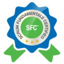
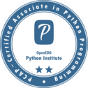

# Computer Systems Engineer

### Contact Me

  
  <strong>Email:</strong> <a href="mailto:luiske83@outlook.es">luiske83@outlook.es</a>

  
  <strong>LinkedIn:</strong> <a href="https://www.linkedin.com/in/luis-kendall-segura-paniagua/">linkedin.com/in/luis-kendall-segura-paniagua</a>

 

## About me
_____________________________________________________________________
I am a young professional passionate about technology, always looking for new opportunities to learn and grow. I have experience in different IT areas, such as programming, databases, technical support, etc. I stand out for my ability to solve problems in a critical and creative way.

On the other hand, in my free time I like to play video games, play sports especially Basketball, learn new skills, and drink coffee.

 

## Work Experience
_____________________________________________________________________

  
<strong>Software Development, University Community Work</strong>

  
<em>(Mar 2024 - Apr 2024)</em>

<em>Municipalidad de Alajuela, Alajuela</em>

 

  
<strong>IT Internship</strong>

  
<em>(Oct 2019 - Dec 2019)</em>

<em>UPS, Alajuela</em>

 

## Education
_____________________________________________________________________

  
<strong>Bachelor's Degree, Computer Systems Engineering</strong>

  
<em>(Jan 2020 - Dec 2023)</em>

<em>Universidad Fidélitas, Heredia</em>

 

  
<strong>Medium Technician, Software Development Computing</strong>

  
<em>(Jan 2017 - Dec 2019)</em>

<em>Colegio Técnico Profesional de Carrizal, Alajuela</em>

 

 

## Skills
_____________________________________________________________________

### Programming Languages
- Python, JS
- JavaScript
- Java
- SQL

### Web Development
- HTML & CSS
- React
- Node.js

### Tools & Technologies
- Git & GitHub
- Docker
- Jenkins

### Soft Skills
- Critical Thinking
- Problem-Solving
- Team Collaboration
- Effective Communication

 

## Certifications & Courses
_____________________________________________________________________
<ul>
  <li>
    <strong>Six Sigma Yellow Belt (SSYB)</strong> <em>(2024)</em>
    
  </li>
  <li>
    <strong>Scrum Fundamentals Certified (SFC)</strong> <em>(2020)</em>
    
  </li>
  <li>
    <strong>PCAP: Programming Essentials in Python</strong> <em>(2019)</em>
    
  </li>
  <li>
    <strong>Business Soft Skills Development</strong> <em>(2019)</em>
  </li>
</ul>

**PCAP** | PCAP: Programming Essentials in Python  | 

 

## Awards & Extracurricular Activities
_____________________________________________________________________

### Second place - EXPO Ingeniería 2018
*Colegio Técnico Profesional de Carrizal, Alajuela*  

Second place at the EXPO Ingeniería 2018 fair at Colegio Técnico Profesional de Carrizal,
developing a prototype for a mobile application in Android Studio
